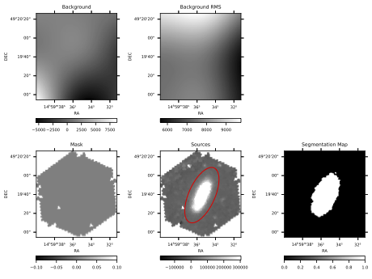
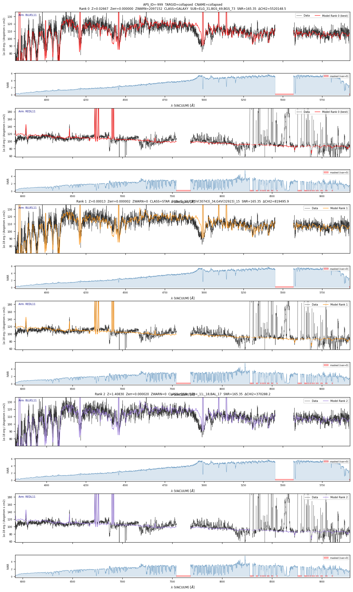
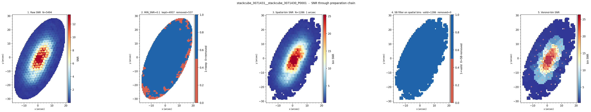
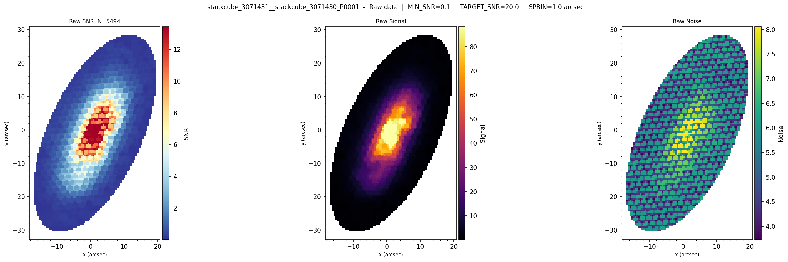
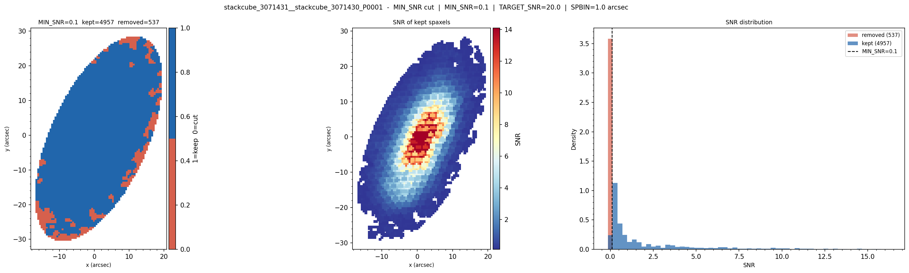
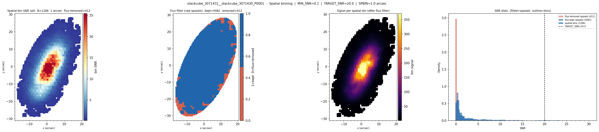
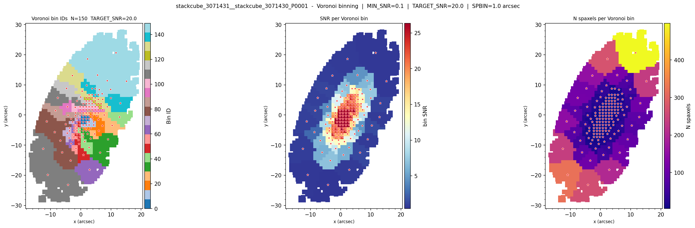

# PyAPS IFU Getting Started Tutorial

**Complete Guide for First-Time Users**

This tutorial will guide you through running PyAPS for IFU (Integral Field Unit) data analysis from scratch. By the end of this tutorial, you'll be able to process WEAVE IFU observations and produce science-ready L2 data products.

---

## ⚠️ Important: When to Use This Tutorial

**This guide is for WEAVE IFU data in CUBE structure ONLY.**

✅ **Use this IFU tutorial if:**
- Your L1 data is in **stackcube** or **superstackcube** format (e.g., `stackcube_*.fit`)
- Data contains IFU spaxel cubes (3D: x, y, wavelength)
- Applies to **all** IFU configurations:
  - ✓ LIFU (Large IFU)
  - ✓ MIFU (Mini IFU)
  - ✓ Any resolution (LR, HR)
  - ✓ Any binning (1×1, 2×1, 4×1, etc.)

❌ **Do NOT use this tutorial if:**
- Your L1 data is at **fiber level** (not cube structure)
- You have MOS (Multi-Object Spectroscopy) data
- Your IFU data is still in individual fiber format
- File names like `stack_*.fit`, `single_*.fit` (without "cube")

> **For fiber-level data (MOS or IFU fibers):** See [MOS_GETTING_STARTED_TUTORIAL.md](MOS_GETTING_STARTED_TUTORIAL.md) instead.

---

---

## Table of Contents

1. [Introduction](#1-introduction)
2. [PyAPS Installation](#2-pyaps-installation)
3. [Data Structure Setup](#3-data-structure-setup)
4. [Downloading Required Templates](#4-downloading-required-templates)
5. [Configuring the Master Config File](#5-configuring-the-master-config-file)
6. [Understanding Your Input Data](#6-understanding-your-input-data)
7. [Running aps_runner.py](#7-running-apsrunnerpy)
8. [Understanding the Generated Scripts](#8-understanding-the-generated-scripts)
9. [Running the IFU Pipeline Scripts](#9-running-the-ifu-pipeline-scripts)
10. [Understanding the Outputs](#10-understanding-the-outputs)
11. [Diagnostic Plots and Quality Assessment](#11-diagnostic-plots-and-quality-assessment)
12. [Advanced Options](#12-advanced-options)
13. [Troubleshooting](#13-troubleshooting)

---

## 1. Introduction

### About This Tutorial

This tutorial focuses on **`aps_runner.py`** - the most straightforward method for running PyAPS, especially recommended for users new to the pipeline. `aps_runner.py` automates the entire workflow from L1 input data to L2 science products, handling all the complexity behind the scenes.

### User Experience Levels

PyAPS for WEAVE is designed to accommodate different levels of expertise:

**🟢 Beginner Users (This Tutorial)**
- Use `aps_runner.py` to automatically generate and run all pipeline scripts
- The pipeline orchestrates the entire process with minimal user intervention
- Automatically handles L1 data model considerations and applies necessary fixes to raw data

**🟡 Intermediate Users**
- Modify parameters in the master config file (`script_params_master.yaml`)
- Edit the generated scripts before running them for fine-tuned control
- Explore the extensive configuration options available in IFU JSON config files

**🔴 Advanced Users**
- Run individual PyAPS modules directly (e.g., `aps_ifu_ExGal.py`, `aps_ifu_Gal.py`)
- Set debug parameters at the bottom of module files for detailed diagnostics
- Customize processing workflows and integrate with custom analysis pipelines

### The PyAPS Architecture

PyAPS for WEAVE is a critical component in the **end-to-end automatic data processing chain** for WEAVE, spanning from observation preparation through to data archiving. This means PyAPS must handle significant complexity:

**Why is PyAPS complex?**
- **Multiple data types**: Single exposures, stacks, superstacks across MOS and IFU modes
- **Evolving instrument**: Different data versions after instrument modifications and upgrades over time
- **Diverse science cases**: Processing everything from nearby stars and nebulae to high-redshift galaxies and QSOs
- **Unexpected scenarios**: Handling edge cases, partial failures, and non-standard configurations
- **Survey diversity**: Supporting dozens of WEAVE surveys with different scientific requirements

PyAPS for WEAVE uses an **automatic orchestration approach** that:

- **Handles L1 data complexities**: Accounts for WEAVE data model specifications, instrument configurations, and observing modes
- **Applies necessary corrections**: Automatically applies fixes and calibrations to raw L1 data before L2 processing
- **Manages dependencies**: Ensures correct execution order (e.g., IFU_Prepare must complete before ExGal/Gal)
- **Centralizes data handling**: Uses the `APSOB` (APS Object) superclass for unified spectral data access
- **Adapts to context**: Automatically detects data characteristics and adjusts processing parameters

> **For deeper understanding**:
> - See [aps_utils.md](aps_utils.md) for detailed documentation on how `APSOB` is constructed and how it handles WEAVE data internally

### Scope of This Tutorial

**What this tutorial covers:**
- ✅ Basic installation and setup
- ✅ Running the pipeline with default/recommended parameters
- ✅ Understanding outputs and diagnostic plots
- ✅ Basic troubleshooting

**What this tutorial does NOT cover:**
- ❌ All available configuration parameters (hundreds of options exist!)
- ❌ Advanced customization and parameter tuning
- ❌ Module-specific deep-dives
- ❌ Integration with contributed software (CS) codes

> **This is a getting-started guide only.** For comprehensive documentation on individual modules, configuration options, and advanced usage, consult:
> - [aps_ifu_prepare.md](aps_ifu_prepare.md) - Target detection and preparation
> - [aps_ifu_ExGal.md](aps_ifu_ExGal.md) - Galaxy and QSO analysis
> - [aps_ifu_Gal.md](aps_ifu_Gal.md) - Stellar analysis
> - [aps_utils.md](aps_utils.md) - Core data handling (APSOB)
> - [aps_calib.md](aps_calib.md) - LSF and FWHM calibration
> - [README.md](../README.md) - Complete PyAPS overview

---

## 2. PyAPS Installation

### Prerequisites

- Python 3.8 - 3.12
- pip package manager
- Git
- Sufficient disk space (~50 GB for minimal templates, ~500 GB for full templates)

### Installation Steps

1. **Clone the PyAPS repository**

```bash
cd $HOME
git clone <repository-url> PyAPS
cd PyAPS
```

2. **Install PyAPS in development mode**

```bash
# Recommended: Create a virtual environment first
python3 -m venv $HOME/venv_WEAVE
source $HOME/venv_WEAVE/bin/activate

# Install PyAPS with all dependencies
python3 -m pip install -e .
```

3. **Verify installation**

```bash
python3 -c "import PyAPS; print(PyAPS.__version__)"
```

If you see a version number, the installation was successful!

### External Dependencies (Optional)

For advanced stellar analysis (Gal mode), you'll need FERRE:

```bash
cd <PYAPS_DIR>/externals
# Follow instructions in externals/README.md
```

For basic ExGal (galaxy) analysis, external dependencies are not required.

---

## 3. Data Structure Setup

### Understanding PyAPS Directory Structure

PyAPS uses a specific directory structure to organize data, templates, and outputs. For testing purposes, you can create your own structure using the `PyAPS_local` directory, which is not tracked by git.

### Creating Your Test Data Structure

```bash
cd <PYAPS_DIR>
cd PyAPS_local
```

Create the following directory structure:

```
PyAPS_local/
├── PyAPS_data/
│   ├── CAL/           # Calibration files (LSF, FWHM from arc lamps)
│   │   ├── 20230512/  # Calibration date directories
│   │   ├── 20240808/
│   │   └── 20250909/
│   ├── CAT/           # External target catalogues (optional)
│   ├── CS/            # Contributed Software outputs (optional)
│   ├── L1/            # Input L1 stacked cubes
│   │   ├── 20240105/  # Multiple observation dates
│   │   │   ├── stackcube_3050123.fit  # Single exposure
│   │   │   └── stackcube_3050124.fit
│   │   ├── 20240808/  # Another night
│   │   │   ├── stackcube_3071430.fit  # Red arm (lower number)
│   │   │   ├── stackcube_3071431.fit  # Blue arm (higher number)
│   │   │   ├── stack_3071500.fit      # Stack files (multiple exposures)
│   │   │   └── stack_3071501.fit
│   │   └── 20250315/  # Yet another night
│   │       ├── single_r3120100.fit    # Different naming conventions
│   │       └── single_r3120101.fit
│   ├── L2/            # Output L2 products (created automatically)
│   └── XML/           # WEAVE XML files (optional)
└── PyAPS_templates/   # Templates and grids
    ├── templates_RR/          # Redrock PCA templates
    ├── templates_ARC_RR/      # Redrock archetype templates
    ├── templates_ExGal/        # pPXF stellar templates (MILES, etc.)
    ├── templates_FR/          # FERRE grids (for stellar analysis)
    ├── templates_RVS/         # RVSpecfit templates
    └── [other template dirs]
```

Create these directories:

```bash
cd <PYAPS_DIR>/PyAPS_local

# Create data directories
mkdir -p PyAPS_data/{CAL,CAT,CS,L1,L2,XML}

# Create template directories
mkdir -p PyAPS_templates/{templates_RR,templates_ARC_RR,templates_ExGal,templates_FR,templates_RVS}
```

### About Each Directory

#### `L1/` — Input Data
Contains your WEAVE L1 stacked cube files, organized by observation date (YYYYMMDD format). Each nightobs subdirectory can contain one or more pairs of stackcube files.

**Important File Naming Convention:**
- **Higher OBSID = Blue arm** (e.g., stackcube_3071431.fit covers ~3800-5950 Å)
- **Lower OBSID = Red arm** (e.g., stackcube_3071430.fit covers ~5900-9280 Å)

**Examples:**
```
L1/
├── 20240105/  # First observation night
│   ├── single_r3050123.fit      # Red arm, single exposure
│   └── single_r3050124.fit      # Blue arm, single exposure
├── 20240808/  # Second observation night (multiple datasets)
│   ├── stackcube_3071430.fit    # Red arm (lower number)
│   ├── stackcube_3071431.fit    # Blue arm (higher number)
│   ├── stack_3071500.fit        # Red arm, different target
│   └── stack_3071501.fit        # Blue arm, different target
└── 20250315/  # Third observation night
    ├── stackcube_3120100.fit    # Red arm
    └── stackcube_3120101.fit    # Blue arm
```

You can have multiple observation nights, and each night can contain multiple pairs of files corresponding to different IFU pointings or stacking levels.

#### `L2/` — Output Data
PyAPS automatically creates this structure when you run the pipeline. You can leave it empty for now.

CAL/ — Calibration Data

Contains wavelength calibration files and LSF (Line Spread Function) data. This is highly recommended but not mandatory for your first test run.

Where to get calibration data:

* Query and download individual calibration sets from:
    https://camcead.ast.cam.ac.uk/weave/calibquery/search
* Organize calibrations by calibration date:

CAL/
├── 20230512/
├── 20230615/
└── 20240808/
└── ...

Minimal setup for this tutorial

For the test dataset used in this tutorial (NIGHTOBS = 20240808), you do not need the full calibration archive. Only a single calibration set is required:

CAL/20240320/

The calibration set dated 20240320 is valid from 20 March 2024 until 29 June 2025, and therefore covers the example observations used in this tutorial.

Bulk download

If you plan to process data from multiple observing periods, you may prefer to download the complete calibration archive covering May 2023 – April 2026:

wget https://www.camcead.ast.cam.ac.uk/weave/downloads/CAL.tar.gz

After downloading:

tar -xzf CAL.tar.gz

This will create the full CAL/ directory structure containing all available calibration releases.

Important: If no calibration data are provided, PyAPS will fall back to default LSF values. This is generally sufficient for installation testing and pipeline familiarisation, but using the appropriate calibration set is strongly recommended for scientific analysis and production processing.


#### `CAT/` — Catalogues (Optional)
External target catalogues for advanced pipeline modes. Not needed for basic IFU runs.

#### `XML/` — XML Files (Optional)
WEAVE observing block XML files. Only required for database-driven pipeline modes.

---

## 4. Downloading Required Templates

Templates are essential for running the pipeline. You need:

1. **Minimal templates** (for testing): ~10 GB
2. **Full templates** (for production): ~500 GB

### Downloading Minimal Templates

For your first run, download the minimal template set:

```bash
cd <PYAPS_DIR>/PyAPS_local/PyAPS_templates

# Download the minimal template archive
wget https://camcead.ast.cam.ac.uk/weave/downloads/PyAPS_templates.tar.gz

# Extract
tar -xzf PyAPS_templates.tar.gz

# This creates the necessary template directories
```

### Template Directory Contents

After extraction, you should have:

```
PyAPS_templates/
├── templates_RR/          # Redrock PCA templates for classification
├── templates_ARC_RR/      # Redrock archetype templates
├── templates_ExGal/        # MILES stellar population templates
├── templates_FR/          # FERRE stellar atmosphere grids (if available)
└── templates_RVS/         # RVSpecfit templates
```

### Full Template Set (Production Use)

For production runs with all features, contact the PyAPS admin at amolaei@ast.cam.ac.uk to obtain access to the full template set.

---

## 5. Configuring the Master Config File

The master configuration file controls all pipeline parameters. PyAPS provides a template that you need to customize for your system.

### Copy the Master Template

```bash
cd <PYAPS_DIR>/PyAPS_local
cp <PYAPS_DIR>/configs/script_params_master.yaml ./script_params_local.yaml
```

### Edit the Configuration File

Open `script_params_local.yaml` in your favorite text editor and update the following critical parameters:

```bash
nano script_params_local.yaml
```

### Essential Parameters to Update

**You MUST replace `<PyAPS_DIR>` with your actual PyAPS installation path throughout the entire file.** Here's a complete list of all parameters that reference `<PyAPS_DIR>`:

```yaml
# ============================================
# General PARAMS - UPDATE ALL PATHS!
# ============================================
PyAPS_DIR: '<PyAPS_DIR>/py/PyAPS'
PyAPS_RES: '<PyAPS_DIR>/PyAPS_local/PyAPS_data/L2'
CS_RES: '<PyAPS_DIR>/PyAPS_local/PyAPS_data/CS'
PyAPS_CAT: '<PyAPS_DIR>/PyAPS_local/PyAPS_data/CAT'
PyAPS_CAL: '<PyAPS_DIR>/PyAPS_local/PyAPS_data/CAL'
PyAPS_XML: '<PyAPS_DIR>/PyAPS_local/PyAPS_data/XML'
PyAPS_CONFIG: '<PyAPS_DIR>/configs'
PyAPS_EXGALCONFIG: '<PyAPS_DIR>/configs/ExGal_configs'

# ============================================
# Template Paths - UPDATE ALL!
# ============================================
templates_RR: '<PyAPS_DIR>/PyAPS_local/PyAPS_templates/templates_RR'
templates_ARC_RR: '<PyAPS_DIR>/PyAPS_local/PyAPS_templates/templates_ARC_RR'
templates_RVS: '<PyAPS_DIR>/PyAPS_local/PyAPS_templates/templates_RVS'
templates_FR: '<PyAPS_DIR>/PyAPS_local/PyAPS_templates/templates_FR'
templates_ExGal: '<PyAPS_DIR>/PyAPS_local/PyAPS_templates/templates_ExGal'

# ============================================
# Virtual Environment - UPDATE!
# ============================================
use_venv: 'True'
venv_path: '$HOME/venv_WEAVE/bin/activate'  # Or your venv path

# ============================================
# MOS MODE Parameters with <PyAPS_DIR>
# ============================================
config_RVS: '<PyAPS_DIR>/configs/rvs_config.yaml'
FERRE_EXE: '<PyAPS_DIR>/externals/ferre/bin/ferre.x'
linemask_FR: '<PyAPS_DIR>/configs/ferre_linemasks/mask_APS_state_20260319.csv'

# ============================================
# IFU MODE Parameters with <PyAPS_DIR>
# ============================================
IFU_templates_CLASS_PCA: '<PyAPS_DIR>/PyAPS_local/PyAPS_templates/templates_RR'
IFU_templates_CLASS_ARC: '<PyAPS_DIR>/PyAPS_local/PyAPS_templates/templates_ARC_RR'

# ============================================
# CS (Contributed Software) Paths - UPDATE if using CS!
# ============================================
SQ_templates: '<PyAPS_DIR>/PyAPS_local/PyAPS_templates/templates_SQ'
SQ_model: '<PyAPS_DIR>/PyAPS_local/PyAPS_templates/templates_SQ/BOSS_train_64plates_model.json'

FESWI_path: '<PyAPS_DIR>/CS/FESWI/'
FESWI_spectral_windows: '<PyAPS_DIR>/CS/FESWI/spectral_windows/spectral_windows-dev.json'
FESWI_cold_blue_grid: '<PyAPS_DIR>/PyAPS_local/PyAPS_templates/templates_FESWI/grid_cold-blue.dat'
FESWI_cold_red_grid: '<PyAPS_DIR>/PyAPS_local/PyAPS_templates/templates_FESWI/grid_cold-red.dat'
FESWI_hot_blue_grid: '<PyAPS_DIR>/PyAPS_local/PyAPS_templates/templates_FESWI/grid_hot-blue.dat'
FESWI_hot_red_grid: '<PyAPS_DIR>/PyAPS_local/PyAPS_templates/templates_FESWI/grid_hot-red.dat'

SPACE_exe: '<PyAPS_DIR>/CS/SPACE/SPACE_v1.4W'
SPACE_templates_dir: '<PyAPS_DIR>/PyAPS_local/PyAPS_templates/templates_SPACE/'

AMY_templates_dir: '<PyAPS_DIR>/PyAPS_local/PyAPS_templates/templates_AMY/'

AN_neat_null: '<PyAPS_DIR>/configs/neat_null.fits'
AN_alfa_exe: '<PyAPS_DIR>/CS/ALFA_NEAT/ALFA/alfa'
AN_neat_exe: '<PyAPS_DIR>/CS/ALFA_NEAT/NEAT/neat'

RRLGV_ephemfile: '<PyAPS_DIR>/CS/RRLGV/ephemerids_files/ephemerids.txt'
RRLGV_calibrate_metal: '<PyAPS_DIR>/CS/RRLGV/metallic.txt'
RRLGV_calibrate_liu: '<PyAPS_DIR>/CS/RRLGV/liu.txt'

RRLEW_hr_lines: '<PyAPS_DIR>/CS/RRLEW/gala_test_HR_RRLYR_list.in'
RRLEW_lr_lines: '<PyAPS_DIR>/CS/RRLEW/gala_test_LR_RRLYR_list.in'
```

**Example of what your edited paths should look like:**

If your PyAPS is installed in `<PYAPS_DIR>`, replace every `<PyAPS_DIR>` with that path:

```yaml
PyAPS_DIR: '<PYAPS_DIR>/py/PyAPS'
PyAPS_RES: '<PYAPS_DIR>/PyAPS_local/PyAPS_data/L2'
templates_RR: '<PYAPS_DIR>/PyAPS_local/PyAPS_templates/templates_RR'
# ... and so on for ALL parameters listed above
```

**Pro tip:** Use find-and-replace in your text editor:
- Find: `<PyAPS_DIR>`
- Replace with: `<PYAPS_DIR>` (or your actual path)

**Important:** Use absolute paths, not relative paths!

### Virtual Environment Settings

If you're using a virtual environment (recommended):

```yaml
use_venv: 'True'
venv_path: '$HOME/venv_WEAVE/bin/activate'
```

If you're NOT using a virtual environment:

```yaml
use_venv: 'False'
venv_path: ''
```

### IFU-Specific Parameters

These control the IFU pipeline behavior (usually don't need changing for first run):

```yaml
# IFU MODE
seg2d: 'True'                    # Enable 2D source detection
seg2d_white_src: 'weave'         # Use WEAVE white-light image
seg2d_extract: 'True'            # Extract sources
seg2d_exclude_ctarg: 'True'      # Exclude central target from segmentation
seg2d_ext_thresh: '2.5'          # Detection threshold (sigma)
seg2d_minarea: '300'             # Minimum source area (pixels)
seg2d_radii_factor: '8.0'        # Aperture expansion factor
class_patch: 'True'              # Run Redrock classification
IFU_RUN_PPXF: 'True'            # Run stellar kinematics
IFU_RUN_EMIPPXF: 'True'         # Run emission line fitting
IFU_RUN_LS: 'True'              # Run line strength measurements
```

### Save and Verify

After editing, verify your config file has valid YAML syntax:

```bash
python3 -c "import yaml; yaml.safe_load(open('script_params_local.yaml'))"
```

If there are no errors, your config file is ready!

---

## 6. Understanding Your Input Data

### What are L1 Stacked Cubes?

L1 stacked cubes are the output from the WEAVE CPS (Common Pipeline System). They contain:
- Flux data for all IFU fibers
- Wavelength calibration
- Inverse variance (error) information
- Metadata about the observation

### File Naming Convention

```
stackcube_<OBSID>.fit
```

Where `<OBSID>` is the WEAVE observation block ID.

For LIFU LR (Low Resolution) observations, you'll typically have **two files** per pointing:

- **Red arm**: **Lower OBSID** (e.g., `stackcube_3071430.fit`) - covers ~5900-9280 Å
- **Blue arm**: **Higher OBSID** (e.g., `stackcube_3071431.fit`) - covers ~3800-5950 Å

> **Important:** The OBSID numbering is critical for the pipeline to correctly identify which arm is which!

### Standard Two-Arm Processing

For this tutorial, let's assume you have two stackcube files from observation date 20240808:

```bash
cd <PYAPS_DIR>/PyAPS_local/PyAPS_data/L1

# Create date directory
mkdir -p 20240808

# Copy or move your data files here
# stackcube_3071430.fit (red arm - lower number)
# stackcube_3071431.fit (blue arm - higher number)
```

Your L1 directory should now look like:

```
L1/
└── 20240808/
    ├── stackcube_3071430.fit  # Red arm (lower OBSID)
    └── stackcube_3071431.fit  # Blue arm (higher OBSID)
```

### Single-Arm Processing (Advanced)

While IFU mode is designed for two-arm (blue + red) data, you can process single-arm data if needed:

**Requirements:**
- You must still provide the file as if it were one element of a two-file pair
- Set `join_arms` parameters appropriately in your config

**Config modifications for single-arm (e.g., blue arm only):**

```yaml
# In script_params_local.yaml:
IFU_join_arms: 'False'       # Don't try to stitch arms
IFU_mask_gaps: 'False'       # No inter-arm gap to mask
IFU_safe_mask_gaps: 'False'  # Disable safe gap masking
```

**Running with single arm:**

```bash
python3 py/PyAPS/aps_runner.py \
    --infiles /path/to/stackcube_3071431.fit \   # Only one file!
    --config_file script_params_local.yaml \
    --mod_wlranges False \
    --wlranges 3800.0,5950.0 \    # Specify blue arm range manually
    --join_arms False \            # Override config
    ... other parameters
```

**Important notes:**
- Single-arm processing limits wavelength coverage and may reduce redshift accuracy
- Some modules (e.g., pPXF) work better with full wavelength coverage
- Classification performance may be degraded with limited wavelength range
- **Two-arm processing is strongly recommended for science applications**

---

## 7. Running aps_runner.py

`aps_runner.py` is the main entry point for the PyAPS pipeline. It performs several important functions:

1. **Health checks** - Validates your installation and file paths
2. **Script generation** - Creates bash scripts tailored to your data
3. **Dependency management** - Ensures correct execution order
4. **Optional execution** - Can run scripts immediately or let you run them manually

### Basic Command Structure

```bash
python3 aps_runner.py \
    --infiles <path_to_blue_arm> <path_to_red_arm> \
    --config_file <path_to_config> \
    [additional options]
```

### Your First Run

Here's a complete example command for your first IFU run:

```bash
# Activate your virtual environment first
source $HOME/venv_WEAVE/bin/activate

# Navigate to your PyAPS directory
cd <PYAPS_DIR>

# Run aps_runner
python3 py/PyAPS/aps_runner.py \
    --infiles <PYAPS_DIR>/PyAPS_local/PyAPS_data/L1/20240808/stackcube_3071431.fit \
              <PYAPS_DIR>/PyAPS_local/PyAPS_data/L1/20240808/stackcube_3071430.fit \
    --config_file <PYAPS_DIR>/PyAPS_local/script_params_local.yaml \
    --cat_list None \
    --aps_ids None \
    --wlranges None \
    --mod_wlranges True \
    --targsrvy None \
    --targclass None \
    --mask_aps_ids None \
    --area None \
    --mask_areas None \
    --headname stackcube_3071431__stackcube_3071430 \
    --hname_suffix None \
    --uapsid 01 \
    --log False \
    --aps_ovr True \
    --CS_ovr True \
    --run_L2 True \
    --run_CS False \
    --mp_LIFU 1 \
    --mp_MIFU 1 \
    --mp_MOS 1 \
    --mp_CS 1 \
    --CPS_path True \
    --hpc 0 \
    --seg2d_white_images None \
    --patch_file None
```

### Understanding the Parameters

#### Input Files
- `--infiles`: Paths to your L1 stackcube files (blue and red arms)
  - Order doesn't matter - PyAPS automatically sorts them
  - Must provide both arms for IFU mode

#### Configuration
- `--config_file`: Path to your master config file
- `--mod_wlranges True`: Use wavelength ranges from config file
  - Set to `False` if you want to specify ranges manually with `--wlranges`

#### Target Selection (All Optional)
- `--cat_list None`: External catalogue file (None for basic runs)
- `--aps_ids None`: Process specific fiber IDs (None = all fibers)
- `--targsrvy None`: Filter by survey code
- `--targclass None`: Filter by target class
- `--mask_aps_ids None`: Exclude specific fibers
- `--area None`: Process only a specific sky region
- `--mask_areas None`: Exclude specific sky regions

#### Naming
- `--headname`: Base name for output files
  - If not specified, auto-generated from input filenames
  - Format: `stackcube_<ID1>__stackcube_<ID2>`
- `--hname_suffix None`: Optional suffix (e.g., "test", "v2")
- `--uapsid 01`: Unique run identifier

#### Execution Control
- `--hpc 0`: **IMPORTANT** - Controls how scripts are executed:
  - `0` = Generate scripts only, don't run them (RECOMMENDED for first time)
  - `1` = Generate and run via bash
  - `2` = Generate and run via kiko
  - `3` = Generate and submit to SLURM

- `--run_L2 True`: Generate L2 pipeline scripts
- `--run_CS False`: Skip contributed software (not needed for basic run)
- `--aps_ovr True`: Overwrite existing outputs
- `--log False`: Don't redirect output to log files (see output in terminal)

#### Multiprocessing
- `--mp_LIFU 1`: Number of parallel threads for LIFU processing
  - Use `1` for first run
  - Can increase to 4-8 for production runs on multi-core systems
- `--mp_MIFU 1`: Threads for MIFU processing
- `--mp_MOS 1`: Threads for MOS processing (not used for IFU-only data)

#### IFU-Specific
- `--seg2d_white_images None`: Custom white-light image (None = auto-generate)
- `--patch_file None`: Pre-existing patch file (None = will be generated)

### Expected Output

When you run `aps_runner.py` successfully, you should see output like this:

```
DEBUG: Modified wavelength used.
DEBUG: Modified wavelength used.
Par: infiles              val: ['<PYAPS_DIR>/PyAPS_local/PyAPS_data/L1/20240808/stackcube_3071431.fit', ...]
Par: config_file          val: <PYAPS_DIR>/PyAPS_local/script_params_local.yaml
...
PyAPS Automatic script Generator for all IFU related configurations [LIFU, MIFU]
------------------------------------------------------------------------------------
Checking inputs...
------------------------------------------------------------------------------------
DEBUG: headname has been set to stackcube_3071431__stackcube_3071430
PATH CHECK: Done!  <PYAPS_DIR>/py/PyAPS
PATH CHECK: Done!  <PYAPS_DIR>/PyAPS_local/PyAPS_data/L2
PATH CHECK: Done!  <PYAPS_DIR>/configs/ExGal_configs
PATH CHECK: Done!  <PYAPS_DIR>/PyAPS_local/PyAPS_templates/templates_RR
PATH CHECK: Done!  <PYAPS_DIR>/PyAPS_local/PyAPS_templates/templates_ARC_RR
PATH CHECK: Done!  <PYAPS_DIR>/PyAPS_local/PyAPS_templates/templates_ExGal
PATH CHECK: Done!  <PYAPS_DIR>/externals/ferre/bin/ferre.x
PATH CHECK: Done!  <PYAPS_DIR>/PyAPS_local/PyAPS_data/L2/20240808/11182
PATH CHECK: Done!  <PYAPS_DIR>/PyAPS_local/PyAPS_data/L2/20240808/11182/scripts
PATH CHECK: Done!  <PYAPS_DIR>/configs/ExGal_configs/LIFULR11.json
INFO: IFU_params JSON loaded: <PYAPS_DIR>/configs/ExGal_configs/LIFULR11.json
...
Generating the single-task script file: .../scripts/01_IFU_Prepare.sh
Generating the single-task script file: .../scripts/01_IFU_ExGal.sh
Generating the single-task script file: .../scripts/01_IFU_Gal.sh
Generating the slurm script file: .../scripts/01_PyAPS_slurm.sh
------------------------------------------------------------------
script execution is disabled by the user (hpc=0)
------------------------------------------------------------------
```

### What Just Happened?

1. ✅ PyAPS validated all your paths
2. ✅ Loaded the IFU configuration for your data (LIFULR11.json)
3. ✅ Created an output directory structure in L2
4. ✅ Generated three executable scripts for IFU processing
5. ⏸️ Stopped before running (because `hpc=0`)

### Output Directory Structure

After running `aps_runner.py`, check your L2 directory:

```bash
ls -la <PYAPS_DIR>/PyAPS_local/PyAPS_data/L2/20240808/11182/
```

You should see:

```
20240808/
└── 11182/                # OBID (observation block ID)
    ├── logs/             # Will contain log files after running scripts
    └── scripts/          # Generated bash scripts
        ├── 01_IFU_Prepare.sh
        ├── 01_IFU_ExGal.sh
        ├── 01_IFU_Gal.sh
        ├── 01_PyAPS_bash.sh     # All-in-one script
        └── 01_PyAPS_slurm.sh    # SLURM submission script
```

---

## 8. Understanding the Generated Scripts

PyAPS generates several scripts for you. Let's understand what each one does.

### The Three Main Scripts

#### 1. `01_IFU_Prepare.sh` - Target Detection & Classification

**What it does:**
- Creates a white-light image by collapsing the IFU cube
- Runs 2D segmentation to detect all sources in the field
- Fits elliptical apertures to each detected source
- Runs Redrock classification and redshift measurement for each source
- Generates LSF (Line Spread Function) calibration data
- Produces a "patch file" (`*_targets.fits`) containing all detected sources

**Output files:**
```
<headname>_white.fits          # White-light image
<headname>_segments.fits       # Segmentation map
<headname>_targets.fits        # Raw patch table
<headname>_targets_mod.fits    # Editable patch table (copy of targets.fits)
figs/                          # Diagnostic plots
```

**When to run:** Always run this first - it's required for the other scripts

**Typical runtime:** 10-30 minutes depending on field complexity

#### 2. `01_IFU_ExGal.sh` - Galaxy & QSO Analysis

**What it does:**
For each GALAXY or QSO target in the patch file:
- Extracts all fibers within the target aperture
- Applies adaptive SNR filtering to remove bad spaxels
- Performs spatial binning and Voronoi tessellation
- Log-rebins spectra for pPXF
- Runs stellar kinematics fitting (pPXF)
- Runs emission line fitting (EMIPPXF)
- Measures line strength indices
- Generates L2 FITS products

**Output files (per target):**
```
<headname>_P0001_table.fits         # Voronoi bin table
<headname>_P0001_BINSpectra.fits    # Binned spectra
<headname>_P0001_ppxf.fits          # Stellar kinematics
<headname>_P0001_emcee.fits         # Emission line fluxes
<headname>_P0001_ls.fits            # Line strengths
<headname>_P0001_APS.fits           # Merged L2 product
figs_ExGal/                         # Diagnostic plots
```

**When to run:** After `IFU_Prepare.sh` completes successfully

**Typical runtime:** 1-3 hours per target (depends on complexity and multiprocessing)

#### 3. `01_IFU_Gal.sh` - Stellar Analysis

**What it does:**
For each STAR target in the patch file:
- Extracts fibers within the aperture
- Performs spatial binning and Voronoi tessellation
- Runs FERRE for stellar atmospheric parameters (Teff, log g, [Fe/H])
- Runs RVS for radial velocities
- Generates L2 FITS products

**Output files (per target):**
```
<headname>_P0001_table.fits              # Voronoi bin table
<headname>_P0001_BINSpectra_linear.fits  # Binned spectra (linear wavelength)
<headname>_P0001_FERRE.fits              # Stellar parameters
<headname>_P0001_RVS.fits                # Radial velocities
<headname>_P0001_APS.fits                # Merged L2 product
figs_Gal/                                # Diagnostic plots
```

**When to run:** After `IFU_Prepare.sh` completes successfully (can run in parallel with ExGal)

**Typical runtime:** 30 minutes - 2 hours per target

### All-in-One Scripts

#### `01_PyAPS_bash.sh`
Runs all three scripts sequentially in the correct order. Useful for automated processing.

#### `01_PyAPS_slurm.sh`
SLURM submission script for HPC environments. Sets up job dependencies so ExGal and Gal run only after Prepare finishes.

### Script Naming Convention

The `01_` prefix is your unique run ID (`uapsid`). If you run the pipeline multiple times with different parameters, use different IDs:
- First run: `--uapsid 01`
- Test run: `--uapsid test`
- High S/N targets only: `--uapsid highsn`

---

## 9. Running the IFU Pipeline Scripts

Now that you understand what each script does, let's run them!

### Step 1: Run IFU Preparation

This is the most important step - it must complete successfully before proceeding.

```bash
cd <PYAPS_DIR>/PyAPS_local/PyAPS_data/L2/20240808/11182/scripts

# Make the script executable
chmod +x 01_IFU_Prepare.sh

# Run it
./01_IFU_Prepare.sh
```

**What to watch for:**
- Path checks should all pass
- Segmentation should find at least one source
- Redrock should complete without major errors
- You should see: "IFU preparation completed successfully"

**If it fails:** See the [Troubleshooting](#13-troubleshooting) section

### Step 2: Inspect the Patch File

Before running ExGal/Gal, **always inspect** the patch file:

```bash
cd <PYAPS_DIR>/PyAPS_local/PyAPS_data/L2/20240808/11182

# Quick inspection with Python
python3 << EOF
from astropy.table import Table
t = Table.read('stackcube_3071431__stackcube_3071430_targets_mod.fits')
print(t)
print("\nDetected targets:")
for row in t:
    print(f"ID {row['id']:3d} | Type: {row['type']} | Class: {row['CLASS'][0].strip():10s} | Z: {row['Z'][0]:.4f}")
EOF
```

**Expected output:**
```
Detected targets:
ID   1 | Type: T | Class: GALAXY    | Z: 0.0923
ID   2 | Type: T | Class: GALAXY    | Z: 0.0941
ID   3 | Type: M | Class: STAR      | Z: 0.0000
```

**Types:**
- `T` = Target (will be processed)
- `C` = Central WEAVE target (will be processed)
- `M` = Mask region (excluded from processing)

**Classes:**
- `GALAXY` → Processed by IFU_ExGal
- `QSO` → Processed by IFU_ExGal
- `STAR` → Processed by IFU_Gal

### Step 3: Edit the Patch File (if needed)

If you notice incorrect classifications or redshifts, you can correct them:

```python
from PyAPS.aps_ifu_tools import (
    explore_patch_table, set_redshift, set_class,
    set_type, save_patch_table
)

headname = "stackcube_3071431__stackcube_3071430"
outpath  = "<PYAPS_DIR>/PyAPS_local/PyAPS_data/L2/20240808/11182/"

# Load and explore
data = explore_patch_table(headname, outpath)
table = data["table"]

# Fix a wrong redshift
set_redshift(table, row_id=1, z=0.0925, zerr=0.0002)

# Fix a wrong classification
set_class(table, row_id=2, class_str="QSO")

# Mark a star as a mask region to exclude it
set_type(table, row_id=3, type_str="M")

# Save modified table
save_patch_table(table, outpath + headname + "_targets_mod.fits")
```

**Important:** The pipeline always reads `*_targets_mod.fits`, not `*_targets.fits`. If you don't make edits, the files are identical.

### Step 4: Run ExGal Analysis

```bash
cd <PYAPS_DIR>/PyAPS_local/PyAPS_data/L2/20240808/11182/scripts

# Make executable
chmod +x 01_IFU_ExGal.sh

# Run it
./01_IFU_ExGal.sh
```

**What to watch for:**
- Each patch (P0001, P0002, etc.) is processed sequentially
- Voronoi tessellation should succeed for each target
- pPXF, EMIPPXF, and LS modules should complete
- Final L2 merge should produce `*_APS.fits` files

**Progress indicators:**
```
Processing patch P0001...
  Voronoi tessellation: 45 bins created
  pPXF: Running on 45 bins...
  EMIPPXF: Fitting emission lines...
  Line strengths: Computing indices...
  L2 merge: Writing stackcube_3071431__stackcube_3071430_P0001_APS.fits
Patch P0001 completed successfully
```

### Step 5: Run Gal Analysis (if you have stellar targets)

```bash
cd <PYAPS_DIR>/PyAPS_local/PyAPS_data/L2/20240808/11182/scripts

# Make executable
chmod +x 01_IFU_Gal.sh

# Run it (can run in parallel with ExGal in a different terminal)
./01_IFU_Gal.sh
```

### Step 6: Verify Outputs

Check that all expected output files were created:

```bash
cd <PYAPS_DIR>/PyAPS_local/PyAPS_data/L2/20240808/11182

# List all APS files (final products)
ls -lh *_APS.fits

# Check diagnostic plots
ls -l figs_ExGal/
ls -l figs_Gal/
```

**You should see:**
- One `*_P####_APS.fits` file per target
- Multiple diagnostic PNG files in `figs_ExGal/` and/or `figs_Gal/`

---

## 10. Understanding the Outputs

### Patch File (`*_targets_mod.fits`)

This is the central file connecting preparation to analysis.

**Key columns:**

| Column | Type | Description |
|--------|------|-------------|
| `id` | int | Unique source ID (determines patch name: P0001, P0002, etc.) |
| `type` | str | `T`=target, `C`=central object, `M`=mask region |
| `RA_icrs`, `DEC_icrs` | float | Sky coordinates (degrees) |
| `A_world`, `B_world` | float | Aperture semi-axes (degrees) |
| `angle` | float | Position angle (degrees E of N) |
| `Z` | float array | Redshifts (top 3 solutions) |
| `ZERR` | float array | Redshift uncertainties |
| `ZWARN` | int array | Redrock warning flags |
| `CLASS` | str array | Classifications: GALAXY, QSO, STAR, WD |
| `SUBCLASS` | str array | Redrock subclass |

**Reading with Python:**
```python
from astropy.table import Table
targets = Table.read('stackcube_3071431__stackcube_3071430_targets_mod.fits')
print(targets.columns)
```

### Per-Patch Outputs (ExGal)

For each galaxy/QSO target, you get:

#### 1. Voronoi Bin Table (`*_P####_table.fits`)
Contains the spatial binning structure.

**Key columns:**
- `BIN_ID`: Voronoi bin identifier
- `X`, `Y`: Sky coordinates
- `SNR`: Signal-to-noise ratio per bin
- `NSPAXELS`: Number of fibers in each bin

#### 2. Binned Spectra (`*_P####_BINSpectra.fits`)
Log-rebinned, co-added spectra for each Voronoi bin.

**HDUs:**
- `SPECTRUM`: 2D array (n_wavelength × n_bins)
- `ERROR`: Error spectrum
- `WAVE`: Rest-frame wavelength array

#### 3. Stellar Kinematics (`*_P####_ppxf.fits`)
pPXF output: stellar velocities and velocity dispersion.

**Key columns:**
- `V`: Line-of-sight velocity (km/s)
- `SIGMA`: Velocity dispersion (km/s)
- `H3`, `H4`: Gauss-Hermite moments
- `V_ERR`, `SIGMA_ERR`: Uncertainties
- `CHI2`: Reduced χ² of the fit

#### 4. Emission Lines (`*_P####_emcee.fits`)
EMIPPXF output: emission line measurements.

**Key columns (per emission line):**
- `FLUX_[LINE]`: Line flux (erg/s/cm²)
- `FLUX_ERR_[LINE]`: Flux uncertainty
- `SIGMA_[LINE]`: Line width (km/s)
- `EW_[LINE]`: Equivalent width (Å)

**Common lines:** Hα, Hβ, [OIII]5007, [NII]6583, [SII]6716, [SII]6731

#### 5. Line Strengths (`*_P####_ls.fits`)
Lick/IDS indices and other spectral features.

**Key columns:**
- Absorption indices: Fe5015, Mgb, NaD, TiO, etc.
- D4000: 4000 Å break strength
- HδA, HγA: Balmer absorption

#### 6. Merged L2 Product (`*_P####_APS.fits`)
**This is the main science product!**

Contains all the above in a single multi-extension FITS file:

**HDU structure:**
```
HDU 0: PRIMARY           # Header with metadata
HDU 1: PATCH_TABLE       # Voronoi bin structure
HDU 2: PATCH_BINSPEC     # Wavelength array
HDU 3: GALAXY_TABLE      # All derived properties (V, σ, fluxes, indices)
HDU 4: GALAXY_SPEC       # Observed, model, and residual spectra
```

**Reading an APS file:**
```python
from astropy.io import fits

hdul = fits.open('stackcube_3071431__stackcube_3071430_P0001_APS.fits')
hdul.info()  # Show all extensions

# Read galaxy properties
from astropy.table import Table
galaxy_tab = Table.read('stackcube_3071431__stackcube_3071430_P0001_APS.fits', hdu='GALAXY_TABLE')
print(galaxy_tab['V'])      # Velocities
print(galaxy_tab['SIGMA'])  # Velocity dispersions
```

### Per-Patch Outputs (Gal)

For stellar targets:

#### 1. FERRE Results (`*_P####_FERRE.fits`)
Stellar atmospheric parameters.

**Key columns:**
- `TEFF`: Effective temperature (K)
- `LOGG`: Surface gravity
- `FEH`: Metallicity [Fe/H]
- `ALPHA`: Alpha enhancement [α/Fe]
- Uncertainties for all parameters

#### 2. RVS Results (`*_P####_RVS.fits`)
Radial velocity measurements.

**Key columns:**
- `VRAD`: Radial velocity (km/s)
- `VRAD_ERR`: Velocity uncertainty
- `TEFF_RVS`: Temperature from RVS
- `LOGG_RVS`: Surface gravity from RVS

#### 3. Merged L2 Product (`*_P####_APS.fits`)
Similar structure to ExGal but with stellar-specific extensions.

### White-Light Image (`*_white.fits`)

Flux-summed image across all wavelengths. Useful for:
- Visual inspection of the field
- Checking aperture placement
- Identifying contamination

### Segmentation Map (`*_segments.fits`)

2D image showing detected sources and their IDs. Each pixel value = source ID.

---
11. Diagnostic Plots and Quality Assessment

PyAPS generates extensive diagnostic plots. Always inspect these before trusting the results!

Preparation Stage Plots (in figs/)

Segmentation Plots

<headname>_segmentation_overview.pdf

Shows:

* White-light image with detected sources outlined
* Source IDs labeled
* Central target marked

<p align="center">
  
</p>

What to check:

* Are all expected sources detected?
* Are apertures reasonable sizes?
* Any spurious detections (noise peaks)?

⸻

Classification Plots

RR_<TARGID>_<CNAME>_<APS_ID>.png

Redrock diagnostic showing:

* Observed spectrum (black line)
* Best-fit template (colored by rank)
* Inverse variance
* Redshift and classification

<p align="center">
  
</p>

What to check:

* Does the template match the features?
* Is IVAR non-zero at key features?
* Any suspicious redshift warnings?

ExGal Diagnostic Plots (in figs_ExGal/)

SNR Evolution: *_snr_stages.png

Most important plot! Shows 5 panels tracking SNR through processing:

1. Raw SNR: Initial spaxel quality
2. MIN_SNR cut: Which spaxels were removed
3. Spatial binning: SNR after pre-binning
4. SB filter: Surface brightness filtering
5. Voronoi: Final Voronoi bins

<p align="center">
  
</p>

What to check:

* Are bad spaxels (SNR < 0.5) being removed?
* Are good spaxels (SNR > 1) being kept?
* Is the final Voronoi SNR reaching the target (usually 20-40)?

⸻

Raw Data: *_prep_raw.png

Three panels:

* SNR map
* Signal map
* Noise map

<p align="center">
  
</p>

What to check:

* Is there real signal in the SNR map?
* Any obvious dead regions or artifacts?
* Is the noise relatively uniform?

⸻

MIN_SNR Cut: *_prep_snrcut.png

* Keep/remove map (blue = kept, orange = removed)
* SNR histogram with threshold marked

<p align="center">
  
</p>

What to check:

* Is the threshold reasonable (typically 0.2-0.5)?
* Are removed spaxels clustered at SNR ≈ 0?
* Any high-SNR spaxels incorrectly removed?

⸻

Spatial Binning: *_prep_spatialbin.png

Four panels showing spatial binning process.

<p align="center">
  
</p>

What to check:

* Are bins well-distributed across the source?
* Flux filter removing only low-SB outskirts?
* SNR histogram showing improvement?

⸻

Voronoi: *_prep_voronoi.png

Three panels:

* Voronoi bin IDs (colored)
* SNR per bin
* Number of spaxels per bin

<p align="center">
  
</p>

What to check:

* Are bins achieving target SNR?
* Reasonable number of bins (20-100 typical for galaxies)?
* Bins larger in low-S/N regions?


### Gal Diagnostic Plots (in `figs_Gal/`)

Similar structure but optimized for stellar targets:
- Higher SNR thresholds
- Larger spatial bins
- Fewer Voronoi bins (10-50 typical)

### Quick Visual Inspection Checklist

✅ **Good signs:**
- Smooth SNR progression through stages
- Target SNR achieved in Voronoi
- Template matches observed spectrum
- No large regions of dead spaxels
- ZWARN = 0 for classifications

⚠️ **Warning signs:**
- Most spaxels removed by filters → check MIN_SNR settings
- Only 1 Voronoi bin → TARGET_SNR too high
- Template doesn't match spectrum → wrong classification?
- Large ZWARN flags → inspect Redrock plot
- Empty SNR map → aperture placement issue?

---

## 12. Advanced Options

### Customizing Segmentation Parameters

Edit these in your config file or IFU JSON config:

```yaml
# More aggressive detection (finds fainter sources)
seg2d_ext_thresh: '2.0'      # Lower threshold
seg2d_minarea: '200'         # Smaller minimum area

# More conservative (fewer spurious detections)
seg2d_ext_thresh: '3.0'      # Higher threshold
seg2d_minarea: '500'         # Larger minimum area

# Larger apertures
seg2d_radii_factor: '10.0'   # Expand apertures by 25%
```

### Adjusting Spatial Binning

Edit `configs/ExGal_configs/LIFULR11.json`:

```json
{
  "SPBIN_SIZE_EXGAL": 1.5,     // Larger spatial bins (default: 1.0)
  "TARGET_SNR": 30,            // Higher S/N per Voronoi bin (default: auto)
  "MIN_SNR_CEILING": 1.0,      // More aggressive bad spaxel removal
  "SB_FILTER_PERCENT": 15      // Remove more low-SB spaxels (default: 10)
}
```

### Running Only Specific Modules

Turn off expensive modules you don't need:

```bash
python3 py/PyAPS/aps_ExGal_worker.py \
    --infiles ... \
    --PPXF True \
    --EMIPPXF False \    # Skip emission lines
    --LS False \          # Skip line strengths
    ...
```

### Processing Single Targets Without a Patch File

**Use case:** You know your target's coordinates and redshift but don't have a patch file from `IFU_Prepare`, or you want to bypass the segmentation step entirely.

**Solution:** Use `--patch_array` to inject target information directly:

```bash
python3 py/PyAPS/aps_ExGal_worker.py \
    --infiles /path/to/stackcube_3071431.fit /path/to/stackcube_3071430.fit \
    --headname my_target \
    --outpath /path/to/output/ \
    --patch_array "1,185.198164,58.092634,101.52,47.25,0.0923,0.0001,GALAXY" \
    --IFU_config_dir /path/to/configs/ExGal_configs/ \
    --ExGal_templates /path/to/templates_ExGal/ \
    --IFU_params /path/to/LIFULR11.json \
    --PPXF True --EMIPPXF True --LS True \
    --wlranges 3800.0,5950.0 5900.0,9280.0 \
    --sens_corr True --mask_gaps True --safe_mask_gaps True \
    --tellurics True --join_arms True
```

**Patch array format** (comma-separated, no spaces):

```
"id,RA_deg,Dec_deg,A_arcsec,B_arcsec,Z,ZERR,CLASS"
```

**Field descriptions:**

| Field | Type | Units | Example | Description |
|-------|------|-------|---------|-------------|
| `id` | int | - | `1` | Patch ID (will create output files like `*_P0001_APS.fits`) |
| `RA_deg` | float | degrees | `185.198164` | Right ascension (ICRS, J2000) |
| `Dec_deg` | float | degrees | `58.092634` | Declination (ICRS, J2000) |
| `A_arcsec` | float | arcsec | `101.52` | Semi-major axis of extraction aperture |
| `B_arcsec` | float | arcsec | `47.25` | Semi-minor axis of extraction aperture |
| `Z` | float | - | `0.0923` | Spectroscopic redshift |
| `ZERR` | float | - | `0.0001` | Redshift uncertainty |
| `CLASS` | str | - | `GALAXY` | Target class: `GALAXY`, `QSO`, `STAR` |

**Examples:**

```bash
# Nearby galaxy at z=0.05
--patch_array "1,180.5,45.2,120.0,80.0,0.05,0.0002,GALAXY"

# High-z QSO at z=2.3
--patch_array "1,215.8,-10.5,30.0,30.0,2.3,0.01,QSO"

# Star (use z=0)
--patch_array "1,160.2,55.8,15.0,15.0,0.0,0.0,STAR"
```

**When to use this:**
- Testing the pipeline on a known target
- You have external redshift information
- You want to process a specific region without running segmentation
- Quick analysis of a single object

**Important notes:**
- Aperture sizes should match the target extent (use DS9 to measure if needed)
- Redshift must be reasonably accurate for galaxies/QSOs (within Δz < 0.01)
- For stars, set Z=0.0 and ZERR=0.0
- The pipeline will process **only** this target (skips segmentation entirely)

### Skipping Segmentation

If you have a pre-existing patch file or want to analyze the full field:

```bash
# In your config:
seg2d: 'False'

# Or create a manual patch for the full field:
# (covers the entire IFU - 0.01 degrees ~ 36 arcsec radius)
patch_array="1,185.198164,58.092634,36.0,36.0,0.0923,0.0001,GALAXY"
```

### Reducing Output File Size

For large fields, omit spectral extensions:

```bash
python3 py/PyAPS/aps_ExGal_worker.py \
    ... \
    --no_spec_ext
```

This removes the `GALAXY_SPEC` extension from `*_APS.fits`, keeping only:
- Parameter tables
- Voronoi structure
- Derived properties (V, σ, fluxes, indices)

### Multiprocessing for Speed

Once your first run works, increase parallelization:

```bash
python3 py/PyAPS/aps_runner.py \
    ... \
    --mp_LIFU 6 \      # Use 6 CPU cores for LIFU
    --hpc 1            # Run immediately after generating
```

**Typical speedup:**
- 1 core: 2 hours per galaxy
- 4 cores: 45 minutes per galaxy
- 8 cores: 30 minutes per galaxy

**Diminishing returns above 8 cores** for most targets.

---

## 13. Troubleshooting

### Installation Issues

#### Problem: `ImportError: No module named 'PyAPS'`

**Solution:**
```bash
# Verify installation
pip show PyAPS

# If not found, reinstall:
cd <PYAPS_DIR>
pip install -e .

# Check Python path
python3 -c "import sys; print('\n'.join(sys.path))"
```

#### Problem: `ModuleNotFoundError: No module named 'redrock'`

**Solution:**
```bash
pip install redrock
```

Install missing dependencies as they appear.

### aps_runner.py Issues

#### Problem: `PATH CHECK: FAILED! /path/to/templates`

**Solution:**
- Verify the path in your config file exists:
  ```bash
  ls -l /path/to/templates
  ```
- Download templates if missing (see Section 4)
- Fix typos in `script_params_local.yaml`

#### Problem: `No IFU_params JSON file found`

**Solution:**
```bash
ls <PYAPS_DIR>/configs/ExGal_configs/LIFULR11.json

# If missing:
# The file should exist in the repository
# Check your PyAPS installation
```

#### Problem: `AttributeError: 'NoneType' object has no attribute 'split'`

**Solution:**
- Often caused by missing config parameters
- Verify all required fields in config YAML have values (not empty)
- Check for typos in parameter names

### IFU_Prepare Issues

#### Problem: No sources detected

**Possible causes:**
1. Aperture placement wrong
2. Data quality too low
3. Detection threshold too high

**Solution:**
```bash
# Check white-light image
ds9 stackcube_*_white.fits

# Lower detection threshold:
# Edit LIFULR11.json:
"seg2d_ext_thresh": "2.0"  # (was 2.5)

# Rerun aps_runner.py and IFU_Prepare.sh
```

#### Problem: Redrock classification fails

**Error message:** `ValueError: No valid templates found`

**Solution:**
```bash
# Verify Redrock templates exist:
ls <PYAPS_DIR>/PyAPS_local/PyAPS_templates/templates_RR/
ls <PYAPS_DIR>/PyAPS_local/PyAPS_templates/templates_ARC_RR/

# Should contain .fits files

# If empty, re-download templates
```

#### Problem: LSF generation fails

**Warning:** `Using default LSF - calibration files not found`

**This is OK for testing!** But for science:
- Download calibration files from https://camcead.ast.cam.ac.uk/weave/calibquery/search
- Place in `PyAPS_data/CAL/YYYYMMDD/`
- Rerun IFU_Prepare

### ExGal/Gal Issues

#### Problem: "No valid APS IDs found for this patch"

**Possible causes:**
1. Aperture outside IFU footprint
2. RA/Dec coordinates wrong
3. Aperture size too small (A_world, B_world in degrees!)

**Solution:**
```python
# Check patch file apertures:
from astropy.table import Table
t = Table.read('*_targets_mod.fits')
print(t['RA_icrs', 'DEC_icrs', 'A_world', 'B_world'])

# A_world and B_world should be ~0.001-0.05 degrees
# (3.6 to 180 arcsec)

# If too small, manually edit:
t['A_world'][0] = 0.028  # ~100 arcsec
t['B_world'][0] = 0.014  # ~50 arcsec
t.write('*_targets_mod.fits', overwrite=True)
```

#### Problem: "No valid spaxels remaining after filters"

**Possible causes:**
1. MIN_SNR threshold too high
2. SB filter too aggressive
3. Target actually has low S/N

**Solution:**
```json
// Edit LIFULR11.json:
{
  "MIN_SNR": 0.0,              // Disable SNR filter
  "SB_FILTER": 0,              // Disable SB filter
  "MIN_SNR_CEILING": 0.8       // Lower ceiling
}

// Rerun IFU_ExGal.sh
```

Check `*_prep_raw.png` - if the SNR map is empty, the target genuinely has no signal.

#### Problem: Voronoi produces only 1 bin

**Cause:** TARGET_SNR too high for the data

**Solution:**
```json
// Edit LIFULR11.json:
{
  "TARGET_SNR": 15   // Lower target (was auto or 30+)
}
```

Or set to `"None"` for automatic determination.

#### Problem: pPXF fails with "Template library coverage insufficient"

**Cause:** High-redshift target, observed wavelength range shifted out of template coverage

**This is expected at z > 1.5!**

**What happens:**
- pPXF and LS are skipped
- EMIPPXF still runs (if emission window > 200 Å)
- Warning printed: "rest-frame pPXF window < 500 Å"

**No action needed** unless you need stellar kinematics for high-z targets.

### Memory Issues

#### Problem: `MemoryError` or process killed

**Causes:**
1. Too many parallel threads
2. Very large IFU field
3. Insufficient RAM

**Solutions:**
```bash
# Reduce multiprocessing:
--mp_LIFU 1     # (was 6 or 8)

# Process one patch at a time:
# Edit patch file to include only one target
# Rerun, repeat for each target

# Use no_spec_ext to reduce memory:
--no_spec_ext
```

### Permission Issues

#### Problem: `Permission denied: cannot create directory`

**Solution:**
```bash
# Check ownership:
ls -la <PYAPS_DIR>/PyAPS_local/

# Fix permissions:
chmod -R u+w <PYAPS_DIR>/PyAPS_local/
```

### Still Stuck?

1. **Check log files:**
   ```bash
   cd PyAPS_local/PyAPS_data/L2/YYYYMMDD/OBID/logs/
   tail -100 01_IFU_ExGal.log
   ```

2. **Enable debug mode:**
   ```bash
   # In your script, add:
   set -x  # at the top
   ```

3. **Consult detailed documentation:**
   - [aps_ifu_prepare.md](aps_ifu_prepare.md) - Preparation stage
   - [aps_ifu_ExGal.md](aps_ifu_ExGal.md) - Galaxy analysis
   - [aps_ifu_Gal.md](aps_ifu_Gal.md) - Stellar analysis

4. **Contact support:**
   - Email: amolaei@ast.cam.ac.uk
   - Include: error message, log files, PyAPS version

---

## Summary: Quick Reference Checklist

### First-Time Setup
- [ ] Install PyAPS (`pip install -e .`)
- [ ] Create PyAPS_local directory structure
- [ ] Download minimal templates
- [ ] Copy and edit script_params_local.yaml
- [ ] Update all `<PyAPS_DIR>` paths
- [ ] Set virtual environment path

### For Each Observation
- [ ] Copy L1 stackcube files to `L1/YYYYMMDD/`
- [ ] Run `aps_runner.py` with `--hpc 0`
- [ ] Verify scripts generated successfully
- [ ] Run `IFU_Prepare.sh`
- [ ] Inspect patch file (`*_targets_mod.fits`)
- [ ] Edit patch file if needed
- [ ] Run `IFU_ExGal.sh` (for galaxies/QSOs)
- [ ] Run `IFU_Gal.sh` (for stars)
- [ ] Check diagnostic plots in `figs_ExGal/` and `figs_Gal/`
- [ ] Verify `*_APS.fits` files created
- [ ] Inspect results with Python/TOPCAT

### Key Files to Check
- [ ] `*_targets_mod.fits` - Patch table
- [ ] `*_snr_stages.png` - SNR evolution
- [ ] `*_prep_voronoi.png` - Voronoi quality
- [ ] `RR_*.png` - Redrock classifications
- [ ] `*_P####_APS.fits` - Final science products

---

## Appendix A: Example Full Workflow

Here's a complete example from start to finish:

```bash
# 1. Setup (one-time)
cd $HOME
git clone <repo> PyAPS
cd PyAPS
python3 -m venv ../venv_WEAVE
source ../venv_WEAVE/bin/activate
pip install -e .

# 2. Create structure
cd PyAPS
mkdir -p PyAPS_local/PyAPS_data/{L1,L2,CAL}
mkdir -p PyAPS_local/PyAPS_templates

# 3. Download templates
cd PyAPS_local/PyAPS_templates
wget https://camcead.ast.cam.ac.uk/weave/downloads/PyAPS_templates.tar.gz
tar -xzf PyAPS_templates.tar.gz

# 4. Configure
cd <PYAPS_DIR>/PyAPS_local
cp ../configs/script_params_master.yaml script_params_local.yaml
nano script_params_local.yaml  # Edit paths

# 5. Prepare data
cp /path/to/stackcube_*.fit PyAPS_data/L1/20240808/

# 6. Run aps_runner
cd <PYAPS_DIR>
python3 py/PyAPS/aps_runner.py \
    --infiles PyAPS_local/PyAPS_data/L1/20240808/stackcube_3071431.fit \
              PyAPS_local/PyAPS_data/L1/20240808/stackcube_3071430.fit \
    --config_file PyAPS_local/script_params_local.yaml \
    --mod_wlranges True \
    --headname stackcube_3071431__stackcube_3071430 \
    --hpc 0 \
    --run_L2 True \
    --mp_LIFU 1

# 7. Run pipeline
cd PyAPS_local/PyAPS_data/L2/20240808/11182/scripts
chmod +x 01_IFU_*.sh
./01_IFU_Prepare.sh
# (inspect patch file)
./01_IFU_ExGal.sh

# 8. Inspect results
cd ..
ls -lh *_APS.fits
firefox figs_ExGal/*_snr_stages.png
```

---

## Appendix B: Configuration Reference

### Complete LIFULR11.json Explanation

```json
{
  // === Binning & Voronoi ===
  "VORONOI": 1,              // Enable Voronoi tessellation
  "TARGET_SNR": "None",      // Auto-determine target S/N
  "SPBIN_SIZE_EXGAL": 1.0,   // Spatial bin size (arcsec)
  "MIN_SNR": "None",         // Auto adaptive MIN_SNR
  "MIN_SNR_CEILING": 1.5,    // Max MIN_SNR threshold

  // === Surface Brightness Filter ===
  "SB_FILTER": 1,            // Enable SB filter
  "SB_FILTER_MODE": "percentile",
  "SB_FILTER_PERCENT": 10,   // Remove lowest 10% flux

  // === Wavelength Windows ===
  "LMIN_PPXF": 3000.0,       // pPXF blue limit (Å, rest)
  "LMAX_PPXF": 6000.0,       // pPXF red limit
  "LMIN_EMI": 2000.0,        // EMIPPXF blue limit
  "LMAX_EMI": 8600.0,        // EMIPPXF red limit

  // === pPXF Settings ===
  "SSP_LIB": "popstar_total",  // Stellar template library
  "VELSCALE": "None",          // Auto velocity scale
  "MOM": 4,                    // Fit V, σ, h3, h4
  "MDEG": 4,                   // Multiplicative polynomial degree
  "REDDENING": [0.1, 0.1],     // Allow E(B-V) 0-0.1

  // === EMIPPXF Settings ===
  "EMI_MOM": 2,              // Fit line flux & width
  "USE_STELLAR_CONTINUUM": "True",
  "FIX_STELLAR_CONTINUUM": "True",

  // === Line Strengths ===
  "LS_MODE": 1,              // Enable LS
  "LS_RES": "ADAPTED",       // Adapt to data resolution

  // === Segmentation (from IFU_Prepare) ===
  "seg2d_ext_thresh": "2.5",
  "seg2d_minarea": "300",
  "seg2d_radii_factor": "8.0"
}
```

---

**You've reached the end of the tutorial!** You should now be able to process WEAVE IFU data from raw L1 cubes to science-ready L2 products. Happy analyzing! 🌌
